# Learn German Online

Learn German Online is the website of a fictitious online language school. It offers online language classes for German as a foreign language and is targeted towards users who want to learn German in online classes. The students can create an account and purchase courses for different language levels and different formats (i.e. Standard, Business). The purchased courses will be saved and visible in their online profile. There are some information pages as well, on which the students can read more about the course structure and the teachers and where they can fill in a contact form if they have additional questions.

For the admin there is also the possibility to add new courses directly from the frontend. This page, along with the possibility to edit or delete existing courses, becomes accessible after login with admin credentials.

## Business Model

The purpose of the business Learn German Online is to sell and conduct online German classes. It was designed for students who would like to learn German as a foreign language for different reasons, be it as a hobby or for work. 

It is a B2C business model, selling a digital service in form of online language courses with a single payment for the whole course. A variety of different courses is available.

The purpose of the website is to display and offer and sell all available courses. As it is an online business, the website is the only point of sale for their courses. Therefore the website needs to permit completing the purchase of all classes online.

The classes themselves will also be held online via an online communication tool (i.e. Zoom).

### SEO
#### Keywords

For SEO purposes a keyword search has been conducted. The following keywords were found and implemented into the website:

    - German
    - German courses
    - Online School
    - Live Classes
    - Learn Online
    - Learn at Home
    - Complete Beginner
    - German Teachers
    - Speaking German
    - Refresh German
    - Business German
    - Germany, Austria, Switzerland
    - Languages
    - European Framework of Reference for Languages (CEFR)

#### Marketing Types

The users of Learn German Online would be mostly adults. This could be college/university students who need German for their studies, business professionals who need German for their job or people who like to learn languages as a hobby.

These users would most likely use social media and be very used to working with computers, beeing either digital immigrants or digital natives.

The main marketing goal of Learn German Online would be to find as many students as possible online, as it is an online only business.

The following marketing types might be suitable for Learn German Online:

- Content Marketing: 
    - This could be short online videos that explain German grammar or vocabulary with a link to the Learn German Online website.
- Social Media Marketing:
    - This could be organic social media marketing for example on Facebook or Instagram, which allow to upload videos as well.
- Email Marketing:
    - New Courses can be advertised through the Newsletter for which students can sign up on the Learn German Online homepage.

The following Facebook mockup page has been created:

#### Other
 
 - a sitemap.xml has been added to the project
 - a robots.txt has been added to the project
 - a link to to the [Council of Europe Website](https://www.coe.int/en/web/common-european-framework-reference-languages/table-1-cefr-3.3-common-reference-levels-global-scale) has been implemented on the course information page as a link to other high quality websites

## User Stories

### Student
#### Viewing and Navigation
1.	As a student I can see the home page so that I get an overview of what I can learn.
2.	As a student I can see and browse all available courses so that I can make a choice on which one to book.
3.	As a student I can see the details of an individual course so that I can see all necessary information including a course description.
4.	As a student I can see general information about the offered courses and language levels so that I can decide better which course is the right one for me.
5.	As a student I can see information about the teachers so that I can reassure myself about the quality of the offered classes.
6.	As a student I can see contact details of the language school so that I can get in touch in case I have additional questions.
7.	As a student I can see a link to the schools Facebook page so that I can connect with them via social media.
8.	As a student I can sign up for the schools newsletter so that I can receive newsletters with up-to-date information.

#### User account
9.	As a student I can register for an account so that I am able to view my profile. 
10.	As a student I will receive a confirmation email after registering so that I know that my account registration was successful. 
11.	As a student I can login and logout of my account so that I can access my personal information.
12.	As a student I have a personalized user profile so that I can view the courses that I have booked.
13.	As a student I can recover my account password so that I can access my account in case I forgot my password.

#### Sorting and Searching
14.	As a student I can sort the list of all available courses by level so that I can see courses matching my current language level.
15.	As a student I can sort the list of all available courses by course format so that I can quickly choose courses from my preferred course format.
16.	As a student I can sort the list of all available courses by the start date of the course so that I can choose a course that starts on a suitable date.
17.	As a student I can sort the list of all available courses by the weekday on which the course will take place so that I can find a course that fits my schedule.

18.	As a student I can search for a course by level or course format to find a specific course that I want to book.
19.	As a student I can easily see what I have searched for so that I can quickly decide if my desired course is available.

#### Purchase and Checkout
20.	As a student I can see the course(s) that I have in my shopping bag so that I can see which course(s) I am about to purchase.
21.	As a student I can remove a chosen course from my shopping bag so that I can make changes to my purchase before I checkout.
22.	As a student I can easily enter my payment information so that I can check out quickly. 
23.	As a student I can view an order confirmation after checkout so that I can verify I have booked the correct course(s).
24.	As a student I will receive an email confirmation after purchase so that I can keep the confirmation of my course(s) for my records.

### Admin
25.	As an admin I can add new courses to the website so that I can immediately offer new courses once they are organized with the teachers.
26.	As an admin I can edit/update a course so that I can change the status or correct any mistakes.
27.	As an admin I can delete a course so that I can remove a course I have accidentally created.

### Student + Admin
28. As a student/admin I can see messages on the screen so that I know the result of my input.

## UX
### Color Scheme

As a first step the color extractor from [Adobe Color](https://color.adobe.com/create/image) has been used to extract colors from the home page image and the image in the navbar brand.

The light blue color #E4EAF2 from the homepage image has been used as the background color on all pages. The darker blue color #B8C6D9 from the homepage image has been used as the background color for the navbar and footer.

The almost black color #262626 from the navbar image has been used as a background color for the buttons on the website. The dark red color #8C0303 had been used as the background color for the hovered buttons.

The dark red color #8C0303 has also been used as the font color for the disclaimer in the footer and on the checkout page as well as for the warning on the delete course page.

Black #000 was used as font color throughout the page as it contrasts well with the chosen background colors. White #FFF was used as the background color for the buttons as this contrasts well with the chosen button colors.

The contrasts of all colors have been checked in a contrast checker. The contrast testing can be found in  the [TESTING.md](TESTING.md) file. 

### Typography 

Google Fonts has been used to find the font, that is displayed on the website. [Source Serif Pro](https://fonts.google.com/specimen/Source+Serif+Pro#standard-styles) is a serif typeface. As described on Google Fonts the font is designed for a digital environment with simplified letter shapes that are highly readable. It was used for the website to make the content easy to read and navigate for potential and current students.

To provide visual cues icons from [Font Awesome](https://fontawesome.com/) have been used for the social media icon in the footer as well as on the buttons and the exlamation mark of the checkout page and the search icon for the search bar on the courses page.

### Wireframes

Wireframes created with Balsamiq were used to plan the layout of the website.

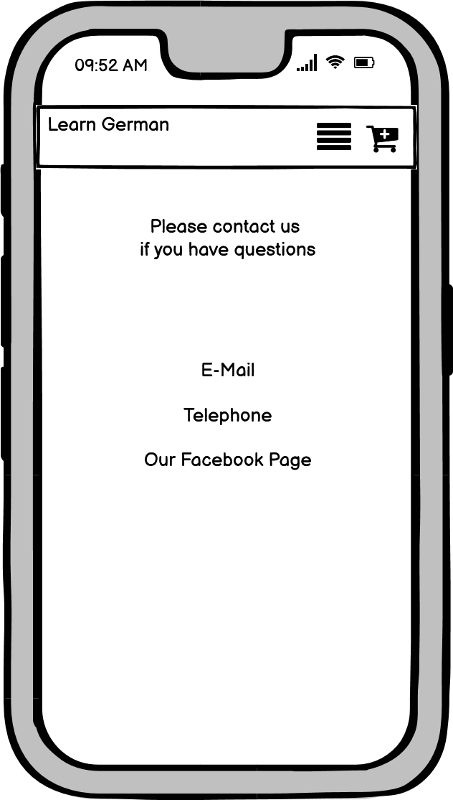

### Flowchart

A flowchart created with Power Point was used to plan the models for the website.

## Features 

### Existing Features

- __Navigation Bar__

    - Featured on all pages the navigation bar includes links to the Homepage, Our Courses, About Us and My Profile. Our Courses has a dropdown menu with sorting options. About Us has a dropdown menu linking to Course Information, Our Teachers and Contact. When not logged in My Profile links to Login and Sign Up. When logged in the My Profile page is accessible and Logout is visible, while Sign Up and Login disappear. When the admin is logged in there is a link to the Add Course page as well. Additionally, when logged in the menu link to the Shopping Bag will appear, displaying the current total in the shopping bag as well.
    - The navigation bar is fully responsive and identical on all pages to offer easy navigation.
    - It allows the user to easily navigate between the different pages across all devices, without having to use the “back” or “forward” buttons.
    - On small screen sizes the navbar will collapse into a toggler icon to keep the page well arranged.

- __Home Page__

  - The Home Page will allow the user to see the aim and purpose of the website.
  - It includes links to the courses page as well as to the Course Structure, Teachers and Contact Page.
  - There is also a form to sign up for the newsletter.

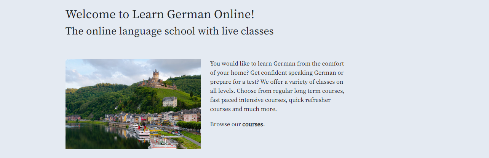

- __Our Courses Page__

    - The Our Courses Page allows the user to see all offered courses.
    - It includes a dropdown menu to sort the courses as well as a searchbar to search for courses. This allows the students to easily find a suitable course for them.

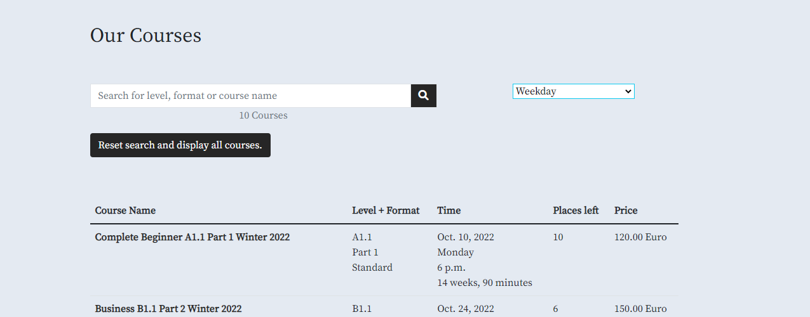

- __Course Detail Page__

    - On the Course Detail Page the student can find all course information including the course description.
    - There is a button to add the course to the shopping bag, if there are still places left for the course. Otherwise there will be a message, that the course is already booked out. The course can only be added once to the bag. Once the course is in the bag, that message will be displayed. It can only be added once, as the name on the booking has to match the name of the student participating in the course.
    - If the student has already booked the course, a message with a link to the confirmation will be displayed.
    - When logged in as admin there will also be the buttons to edit or delete the course.

- Course Detail Admin:
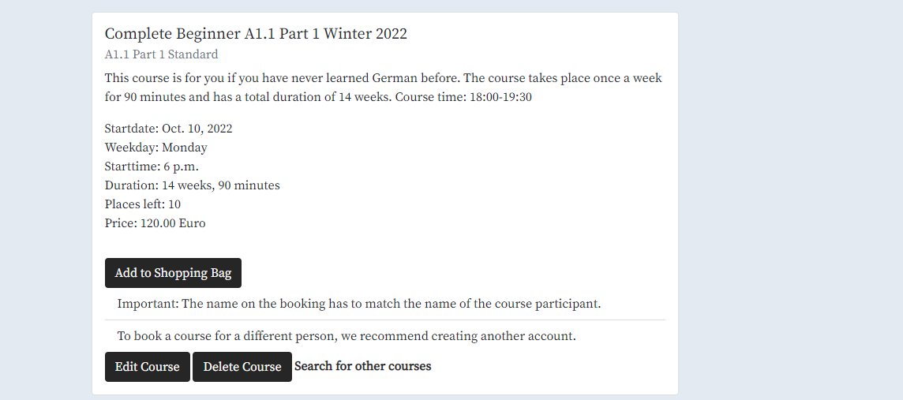
- Course Detail Student:

- __Course Information Page__

    - The course information page offers an explanation and overview of the language levels and the offered course formats.
    - This will allow especially new students to get addiotional information regarding the course structure and they can decide for the most suitable course for them.

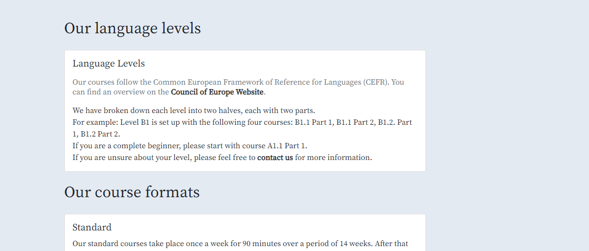

- __Our Teachers Page__

    - The Our Teachers page offers a short introduction and information about the teachers of Learn German Online.
    - This will allow the students to assure themselves of the qualifacations of the schools teachers.

- __Contact Page__

    - On the Contact Page the students can find different options on how to contact the language school.
    - It offers a Contact Form that can be filled in with individual questions as well.
    - This allows students who have any doubts to address their questions directly on the website.

- __Sign Up Page__

    - The Sign Up Page allows the students to create an account.
    - It requires a username, password and email address.
    - A confirmation email will be sent to the student with a link to verify the email address.

- __Login Page__

    - The Login Page allows students, who already created an account, to login with their username and password.

- __Logout Page__

    - The Logout Page allows the user to logout.

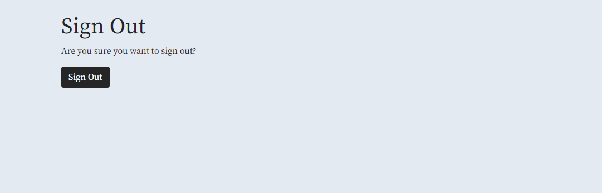

- __Shopping Bag Page__

    - Logged in students can add courses to their shopping bag.
    - The shopping bag page displays the chosen courses or, if no courses a chosen yet, a link to the courses page.
    - The courses in the shopping bag can also be removed from the bag by click on the respective button.
    - When the students want to purchase the chosen course(s) they can click on the Secure Checkout button, which also displays the total order amount.

- __Secure Checkout Page__

    - This page allows the students to complete their purchase by entering their information and credit card details.
    - If the student has their address already saved on their profile, this data will be prefilled into the checkout form.
    - Respectively the student can also check the box to save the entered information to the profile.

- __Checkout Success/Confirmation Page__

    - The Checkout Success Page will display an overview of the order.
    - It appears right after successfully making a purchase.
    - It can also be accessed later on from the booking history in the profile page.

- __My Profile Page__

    - The profile page is visible when logged in.
    - The profile page allows the user to save or edit their address information. If they have already made a purchase with the option to save their information checked, this information will be prefilled here.
    - On the profile page the student can see their booked coures as well. For each booked course the student can also access the booking confirmation by clicking on the order number.

- __Add Course Page__

    - The add course page is visible to the admin only, when logged in.
    - It allows the admin to add a course directly from the frontend.

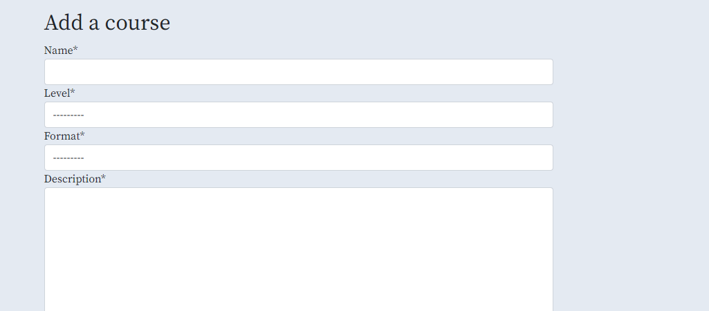

- __Edit Course Page__

    - When logged in as admin the Edit Button will appear on the Course Detail Page of the chosen course.
    - The edit course page is visible to the admin only.
    - It allows the admin to edit a course directly from the frontend.

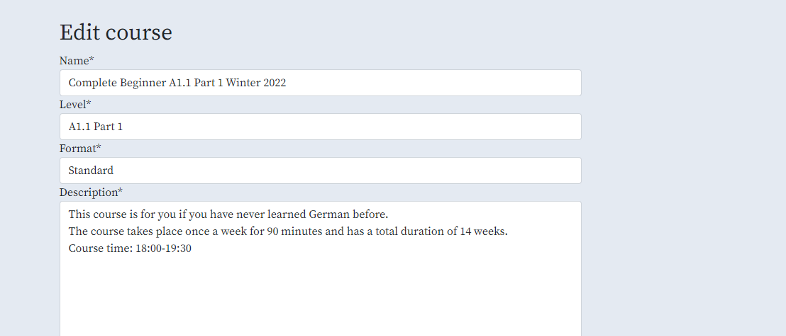

- __Delete Course Page__

    - When logged in as admin the Delete Button will appear on the Course Detail Page of the chosen course.
    - The delete course page is visible to the admin only.
    - It allows the admin to delete a course directly from the frontend.

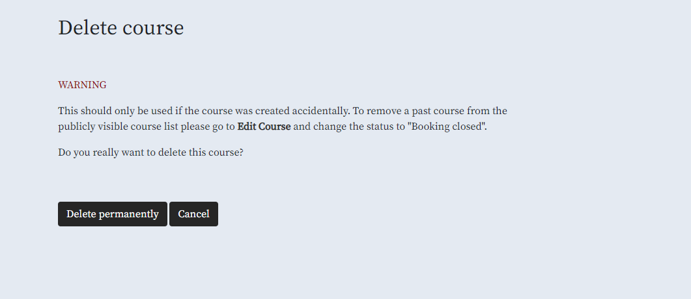

- __Footer__

    - The footer displays a link to the social media website of Learn German Online, so that the student can easily follow them there.
    - There is also a link to the privacy policy.

- __Messages__

    - Messages are displayed at the top of the screen to notify the student about the outcome of their actions (i.e. adding an item to the shopping bag, updating the profile).
    - The same applies to the admin. The admin will also be notified when the have added, edited or deleted a course.
    - This way the student/admin will know when they have changed content.

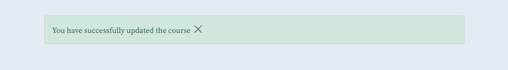

### Features Left to Implement

- __Display Teacher for course & Course search by teacher__

    - Display which teacher is teaching the course and add the functionality to search for courses with specific teachers

- __Teacher Admin__

    - An admin page especially for the teachers, where they can see an overview of the courses they teach together with information about the attending students.
    - It could also contain the functionality to see the submitted contact forms on the frontend and mark them as replied, when a reply has been sent to the student.
    - Additionally the email addresses for the newsletter could be visible on the frontend for teachers who are in charge of creating the newsletter.

## Database Models

 - The courses, checkout, profile, contact; and homepage app require databases to store information. The following models have been build:
    - courses: Level, Format, Course
    - checkout: Order, OrderLineItem
    - profile: UserProfile
    - contact: Contact
    - homepage: Newsletter
 

 __Level & Format__

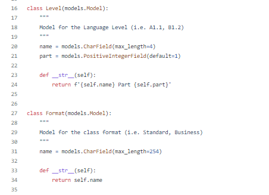

 __Course__

 __Order__

 __OrderLineItem__

 __UserProfile__

 __Contact__

 __Newsletter__

## Technologies Used

- HTML 
    - was used to structure the website semantically and display it in the browser.
- [Bootstrap](https://getbootstrap.com/) 
    - CSS framework used to build responsive design.
- CSS 
    - was used for additional presentation and style of the website.
- JavaScript 
    - was used to make the website interactive.
- [Python](https://www.python.org/) 
    - was used as programming language to write the code.
- [Django](https://www.djangoproject.com/)
    - framework has been used to build the project and the apps.
- [Django Crispy Forms](https://django-crispy-forms.readthedocs.io/en/latest/) 
    - is used to create the forms in the application.
- [Gitpod](https://www.gitpod.io/) 
    - was used for the development of the website.
- [Github](https://github.com/) 
    - was used to store the code online.
- Git 
    - was used for version control.
- [The GitHub Projects Board](https://github.com/JulianeGampe/language-school/projects/1) 
    - was used to keep track of tasks that are still to do or in progress or see tasks that are already done.
- [The GitHub Issues tracker](https://github.com/JulianeGampe/language-school/issues) 
    - was used to keep track of bugs and add solutions.
- [Balsamiq](https://balsamiq.com/wireframes/) 
    - was used to create the wireframes.
- [Microsoft Powerpoint](https://www.microsoft.com/en-ie/microsoft-365/powerpoint)
    - was used to create the Model flowcharts.
- [Font Awesome](https://fontawesome.com/) 
    - was used for the icons.
- [Cloudinary](https://cloudinary.com/) 
    - is used to store static files.
- [Heroku](https://www.heroku.com/home) 
    - is used to deploy the application
- [Google Fonts](https://fonts.google.com/)
    - was used for the website font
- [Adobe Color](https://color.adobe.com/create/image)
    - was used for extracting the colors from the images and for color testing.
- [Stripe](https://stripe.com/)
    - was used for the payments infrastructure.

## Testing

Due to the length of testing, you can see all tests in the [TESTING.md](TESTING.md) file.

## Deployment

- The site was deployed to Heroku.
- Steps for deployment
  - Create a new Heroku app

  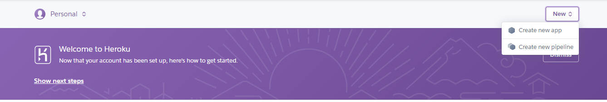
  

  - Attach the database
      1. click on the _Resources_ tab
      2. in the add-ons bar search for Postgres and add it to the project
  
  

  - Set up the _Config Vars_ 
      1. DATABASE_URL is the connection to the Postgres database and is added to the project
      2. add the SECRET_KEY from the django project
      3. add the CLOUDINARY_URL
      4. add the STRIPE_PUBLIC_KEY and STRIPE_SECRET_KEY for payments via stripe
      5. add the EMAIL_HOST_PASS, EMAIL_HOST_USER and DEFAULT_FROM_EMAIL for sending emails

  - Link the Heroku app to the repository in the _Deploy_ tab

  
  
  

  - Click on Deploy

  
  

The live link can be found here - https://languageschoolproject.herokuapp.com/

### Local Deployment

If you would like to make a local copy of this repository, you can clone it by typing the following command in your IDE terminal:
- `git clone https://github.com/JulianeGampe/language-school.git`

Alternatively, if using Gitpod, you can click below to create your own workspace using this repository.

You must install the required packages for this application, using the command:
- `pip3 install -r requirements.txt`

You must set the keys for your environment variables in env.py:
- os.environ["DATABASE_URL"] 
- os.environ["SECRET_KEY"]
- os.environ["CLOUDINARY_URL"]
- os.environ["STRIPE_PUBLIC_KEY"]
- os.environ["STRIPE_SECRET_KEY"]

## Credits 

### Content

- The Code Institute Walkthrough Project [Boutique Ado](https://github.com/Code-Institute-Solutions/boutique_ado_v1) and its respective code have been used as a major guidance throughout the project. The following larger parts have been taken explicitly from this project:
    - bag: contexts.py
    - checkout: models, admin.py, signals.py, apps.py, forms.py, css, stripe_elements.js, in views.py the code to sent confirmation emails (taken from webhook_handler.py of the Boutique Ado Walkthrough)
    - profiles: models (UserProfile Model + @receiver - create or update user profile)
    - contact: in views.py the code to sent confirmation emails (taken from webhook_handler.py of the Boutique Ado Walkthrough)
    - courses: the JavaScript for the sorting box in courses.html, the code for the search bar in courses.html and views.py
- The [Django Allauth Documentation](https://django-allauth.readthedocs.io/en/latest/installation.html) was used war the allauth setup
- The [Bootstrap Documenation](https://getbootstrap.com/docs/5.0/components/dropdowns/) was used to create the dropdown menus in the navbar.
- This [article](https://stackoverflow.com/questions/11754877/troubleshooting-related-field-has-invalid-lookup-icontains) from Stackoverflow was used as a help to make the search work for the foreign key level_name and format_name.
- This [article](https://stackoverflow.com/questions/51394261/python-access-second-element-of-list) from Stackoverflow was used as help for the code to prevent double sign up for the newsletter.
- The [Bootstrap Cards Documenation](https://getbootstrap.com/docs/5.0/components/card/) was used as a help to create the bootstrap cards thoughout the website.
- The Font [Source Serif Pro](https://fonts.google.com/specimen/Source+Serif+Pro#standard-styles) was taken from Google Fonts.
- The [Bootstrap Display Documentation](https://getbootstrap.com/docs/5.0/utilities/display/) was used as a help to display/don't display certain table rows for certain screensizes of the courses table and the booked courses table on the profile page.
- This [article](https://stackoverflow.com/questions/5439901/getting-a-count-of-objects-in-a-queryset-in-django) from Stackoverflow was used as a help to create the variables coursecount + coursecountclosed to calculate the number of courses found in the search, based on the status of the course.

### Media 

- The following images were taken from [Pexels](https://www.pexels.com/):
    - [Homepage Image](https://www.pexels.com/photo/castle-on-hill-over-village-near-body-of-water-547494/)
    - [Navbar Image](https://www.pexels.com/photo/german-flag-painted-on-wooden-background-968308/)
    - [Teacher "Klara"](https://www.pexels.com/photo/woman-in-brown-blazer-writing-on-notebook-4063861/)
    - [Teacher "Veronika"](https://www.pexels.com/photo/woman-wearing-gray-long-sleeved-shirt-and-black-black-bottoms-outfit-sitting-on-gray-wooden-picnic-table-facing-towards-calm-body-of-water-at-daytime-1008000/)
    - [Teacher "Maria"](https://www.pexels.com/photo/photo-of-woman-riding-swing-in-front-of-waterfalls-1160131/)
    - [Teacher "Felix"](https://www.pexels.com/photo/man-wearing-grey-shirt-standing-on-elevated-surface-103123/)
    - [Teacher "Lukas"](https://www.pexels.com/photo/man-standing-on-rocky-mountain-under-white-cloudy-sky-442559/)
- The website icons were taken from [Font Awesome](https://fontawesome.com/)
    - [Search](https://fontawesome.com/v5/icons/search?s=solid)
    - [Exclamation Markt](https://fontawesome.com/v5/icons/exclamation?s=solid)
    - [Back Button](https://fontawesome.com/v5/icons/backward?s=solid)
    - [Credit Card](https://fontawesome.com/v5/icons/credit-card?s=solid)
    - [Facebook](https://fontawesome.com/v5/icons/facebook?s=brands)

### Acknowledgements

- I would like to thank my mentor Tim Nelson for his support, guidance and encouragement
