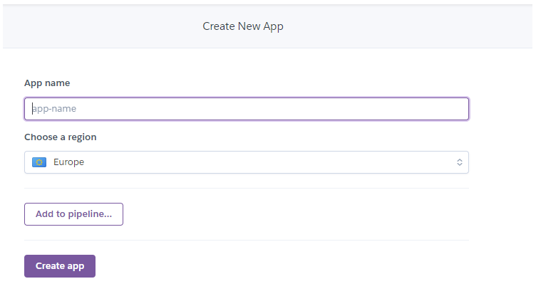

# Online Language School

Description


## User Stories

### Student
#### Viewing and Navigation
1.	As a student I can see the home page so that I get an overview of what I can learn.
2.	As a student I can see and browse all available courses so that I can make a choice on which one to book.
3.	As a student I can see the details of an individual course so that I can see all necessary information including a course description.
4.	As a student I can see general information about the offered courses and language levels so that I can decide better which course is the right one for me.
5.	As a student I can see information about the teachers so that I can reassure myself about the quality of the offered classes.
6.	As a student I can see contact details of the language school so that I can get in touch in case I have additional questions.
7.	As a student I can see a link to the schools Facebook page so that I can connect with them via social media.
8.	As a student I can sign up for the schools newsletter so that I can receive newsletters with up-to-date information.

#### User account
9.	As a student I can register for an account so that I am able to view my profile. 
10.	As a student I will receive a confirmation email after registering so that I know that my account registration was successful. 
11.	As a student I can login and logout of my account so that I can access my personal information.
12.	As a student I have a personalized user profile so that I can view the courses that I have booked.
13.	As a student I can recover my account password so that I can access my account in case I forgot my password.

#### Sorting and Searching
14.	As a student I can sort the list of all available courses by level so that I can see courses matching my current language level.
15.	As a student I can sort the list of all available courses by course format so that I can quickly choose courses from my preferred course format.
16.	As a student I can sort the list of all available courses by the start date of the course so that I can choose a course that starts on a suitable date.
17.	As a student I can sort the list of all available courses by the weekday on which the course will take place so that I can find a course that fits my schedule.

18.	As a student I can search for a course by level or course format to find a specific course that I want to book.
19.	As a student I can easily see what I have searched for so that I can quickly decide if my desired course is available.


#### Purchase and Checkout
20.	As a student I can see the course(s) that I have in my shopping bag so that I can see which course(s) I am about to purchase.
21.	As a student I can remove a chosen course from my shopping bag so that I can make changes to my purchase before I checkout.
22.	As a student I can easily enter my payment information so that I can check out quickly. 
23.	As a student I can view an order confirmation after checkout so that I can verify I have booked the correct course(s).
24.	As a student I will receive an email confirmation after purchase so that I can keep the confirmation of my course(s) for my records.

### Admin
25.	As an admin I can add new courses to the website so that I can immediately offer new courses once they are organized with the teachers.
26.	As an admin I can edit/update a course so that I can change the status or correct any mistakes.
27.	As an admin I can delete a course so that I can remove a course I have accidentally created.

### Student + Admin
28. As a student/admin I can see messages on the screen so that I know the result of my input.

## UX
### Colour Scheme


### Typography 

Google Fonts .... 

To provide visual cues icons from [Font Awesome](https://fontawesome.com/) have been used in ....

### Wireframes

Wireframes created with Balsamiq were used to plan the layout of the website.


### Flowchart

A flowchart createt with Power Point was used to plan the models for the website.


## Features 

### Existing Features

- __Navigation Bar__

    - ....


- __Home Page__

  - The Home Page will allow the user to see the aim and purpose of the website.


### Features Left to Implement

- __Feature__


## Database Models

 - The .... app require databases to store information. .... models have been build.

 __Model Name__


## Technologies Used

- HTML 
    - was used to structure the website semantically and display it in the browser.
- [Bootstrap](https://getbootstrap.com/) 
    - CSS framework used to build responsive design.
- CSS 
    - was used for additional presentation and style of the website.
- JavaScript 
    - was used to make the website interactive.
- [Python](https://www.python.org/) 
    - was used as programming language to write the code.
- [Django](https://www.djangoproject.com/)
    - framework has been used to build the project and the apps.
- [Django Crispy Forms](https://django-crispy-forms.readthedocs.io/en/latest/) 
    - is used to create the forms in the application.
- [TinyMCE](https://www.tiny.cloud/) 
    - is used as the text editor.
- [Gitpod](https://www.gitpod.io/) 
    - was used for the development of the website.
- [Github](https://github.com/) 
    - was used to store the code online.
- Git 
    - was used for version control.
- [The GitHub Projects Board](https://github.com/JulianeGampe/travel-blog/projects/1) 
    - was used to keep track of tasks that are still to do or in progress or see tasks that are already done.
- [The GitHub Issues tracker](https://github.com/JulianeGampe/travel-blog/issues) 
    - was used to keep track of bugs and add solutions.
- [Balsamiq](https://balsamiq.com/wireframes/) 
    - was used to create the wireframes.
- [Font Awesome](https://fontawesome.com/) 
    - was used for the icons.
- [Cloudinary](https://cloudinary.com/) 
    - is used to store and upload the images.
- [Heroku](https://www.heroku.com/home) 
    - is used to deploy the application
- [Google Fonts](https://fonts.google.com/)
    - was used for the website font
- [Adobe Color](https://color.adobe.com/create/image)
    - was used for extracting the colors from the homepage image and for color testing.


## Testing

Due to the length of testing, you can see all tests in the [TESTING.md](TESTING.md) file.

## Deployment

- The site was deployed to Heroku.
- Steps for deployment
  - Create a new Heroku app

  
  

  - Attach the database
      1. click on the _Resources_ tab
      2. in the add-ons bar search for Postgres and add it to the project
  
  

  - Set up the _Config Vars_ 
      1. DATABASE_URL is the connection to the Postgres database and is added to the project
      2. add the SECRET_KEY from the django project
      3. add the CLOUDINARY_URL
      4. add the TINYMCE_API key

  - Link the Heroku app to the repository in the _Deploy_ tab

  
  
  

  - Click on Deploy

  
  


The live link can be found here - https://

### Local Deployment

If you would like to make a local copy of this repository, you can clone it by typing the following command in your IDE terminal:
- `git clone https://github.com/JulianeGampe/language-school.git`

Alternatively, if using Gitpod, you can click below to create your own workspace using this repository.

[](https://gitpod.io/#https://github.com/JulianeGampe/language-school)

You must install the required packages for this application, using the command:
- `pip3 install -r requirements.txt`

You must set the keys for your environment variables in env.py:
- os.environ["DATABASE_URL"] 
- os.environ["SECRET_KEY"]
- os.environ["CLOUDINARY_URL"]
- os.environ["TINYMCE_API"]

## Credits 

### Content

- This [YouTube Video](link) from .... have been used for help with ....
- This article from [Name](link) was used to ....

### Media 

- The following website was used to ...
- The image for ... has been taken from ....[Website](link)

### Acknowledgements

- I would like to thank ....


Welcome JulianeGampe,

This is the Code Institute student template for Gitpod. We have preinstalled all of the tools you need to get started. It's perfectly ok to use this template as the basis for your project submissions.

You can safely delete this README.md file, or change it for your own project. Please do read it at least once, though! It contains some important information about Gitpod and the extensions we use. Some of this information has been updated since the video content was created. The last update to this file was: **September 1, 2021**

## Gitpod Reminders

To run a frontend (HTML, CSS, Javascript only) application in Gitpod, in the terminal, type:

`python3 -m http.server`

A blue button should appear to click: _Make Public_,

Another blue button should appear to click: _Open Browser_.

To run a backend Python file, type `python3 app.py`, if your Python file is named `app.py` of course.

A blue button should appear to click: _Make Public_,

Another blue button should appear to click: _Open Browser_.

In Gitpod you have superuser security privileges by default. Therefore you do not need to use the `sudo` (superuser do) command in the bash terminal in any of the lessons.

To log into the Heroku toolbelt CLI:

1. Log in to your Heroku account and go to *Account Settings* in the menu under your avatar.
2. Scroll down to the *API Key* and click *Reveal*
3. Copy the key
4. In Gitpod, from the terminal, run `heroku_config`
5. Paste in your API key when asked

You can now use the `heroku` CLI program - try running `heroku apps` to confirm it works. This API key is unique and private to you so do not share it. If you accidentally make it public then you can create a new one with _Regenerate API Key_.

------

## Release History

We continually tweak and adjust this template to help give you the best experience. Here is the version history:

**September 1 2021:** Remove `PGHOSTADDR` environment variable.

**July 19 2021:** Remove `font_fix` script now that the terminal font issue is fixed.

**July 2 2021:** Remove extensions that are not available in Open VSX.

**June 30 2021:** Combined the P4 and P5 templates into one file, added the uptime script. See the FAQ at the end of this file.

**June 10 2021:** Added: `font_fix` script and alias to fix the Terminal font issue

**May 10 2021:** Added `heroku_config` script to allow Heroku API key to be stored as an environment variable.

**April 7 2021:** Upgraded the template for VS Code instead of Theia.

**October 21 2020:** Versions of the HTMLHint, Prettier, Bootstrap4 CDN and Auto Close extensions updated. The Python extension needs to stay the same version for now.

**October 08 2020:** Additional large Gitpod files (`core.mongo*` and `core.python*`) are now hidden in the Explorer, and have been added to the `.gitignore` by default.

**September 22 2020:** Gitpod occasionally creates large `core.Microsoft` files. These are now hidden in the Explorer. A `.gitignore` file has been created to make sure these files will not be committed, along with other common files.

**April 16 2020:** The template now automatically installs MySQL instead of relying on the Gitpod MySQL image. The message about a Python linter not being installed has been dealt with, and the set-up files are now hidden in the Gitpod file explorer.

**April 13 2020:** Added the _Prettier_ code beautifier extension instead of the code formatter built-in to Gitpod.

**February 2020:** The initialisation files now _do not_ auto-delete. They will remain in your project. You can safely ignore them. They just make sure that your workspace is configured correctly each time you open it. It will also prevent the Gitpod configuration popup from appearing.

**December 2019:** Added Eventyret's Bootstrap 4 extension. Type `!bscdn` in a HTML file to add the Bootstrap boilerplate. Check out the <a href="https://github.com/Eventyret/vscode-bcdn" target="_blank">README.md file at the official repo</a> for more options.

------

## FAQ about the uptime script

**Why have you added this script?**

It will help us to calculate how many running workspaces there are at any one time, which greatly helps us with cost and capacity planning. It will help us decide on the future direction of our cloud-based IDE strategy.

**How will this affect me?**

For everyday usage of Gitpod, it doesn’t have any effect at all. The script only captures the following data:

- An ID that is randomly generated each time the workspace is started.
- The current date and time
- The workspace status of “started” or “running”, which is sent every 5 minutes.

It is not possible for us or anyone else to trace the random ID back to an individual, and no personal data is being captured. It will not slow down the workspace or affect your work.

**So….?**

We want to tell you this so that we are being completely transparent about the data we collect and what we do with it.

**Can I opt out?**

Yes, you can. Since no personally identifiable information is being captured, we'd appreciate it if you let the script run; however if you are unhappy with the idea, simply run the following commands from the terminal window after creating the workspace, and this will remove the uptime script:

```
pkill uptime.sh
rm .vscode/uptime.sh
```

**Anything more?**

Yes! We'd strongly encourage you to look at the source code of the `uptime.sh` file so that you know what it's doing. As future software developers, it will be great practice to see how these shell scripts work.

---

Happy coding!
