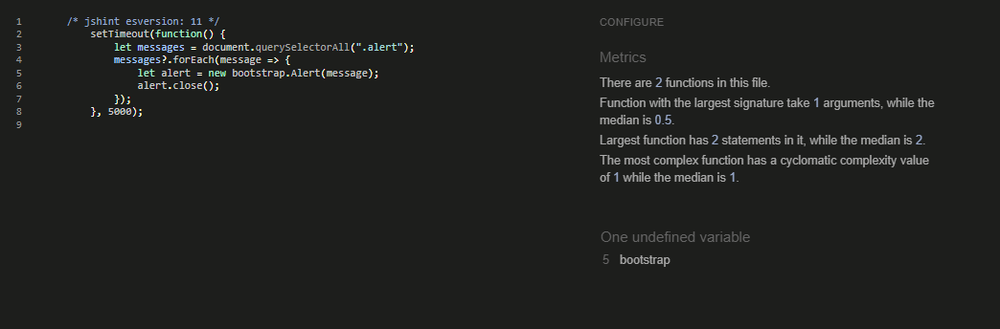

## Testing 

## Manual Testing

### Testing User Stories

The website functionality with all user stories has been tested manually while logged in as testusers, site owner/admin and while not logged in. Additional tests from the user perspective have been made by a friend who created a user account for themselves. 

1. As a user I .....
    

### Javascript
- JavaScript
  - JavaScript was used for the time out function of django contrib messages.
    - This was tested manually. The messages displayed dissappear automatically.
 
    

  - JavaScript was used ..... 
    - This was tested manually as well. 
    - .....

    

### Browser Compatibility

- The page has been tested and works in different browsers.
  - Google Chrome
    
    

  - Firefox
    
    
  
  - Microsoft Edge
    
    

### Responsiveness

- The project is responsive and functions on all standard screen sizes using the devtools device toolbar.

- The navigation, home page, ..... and the footer are readable and easy to understand.

  -  Google Chrome Desktop

    

  - Google Chrome Mobile

    

  - Firefox Desktop

    

  - Firefox Tablet

    
  
  - Microsoft Edge Desktop

    
  
  - Microsoft Edge Mobile

    

## Color Testing

- All colors have been tested with a contrast checker. 
  - Contrast test # against #. (main background color against font color)
  

## Validator Testing 

- PEP8

  - No errors were returned from [PEP8online.com](http://pep8online.com/).

    

    
Click to expand to view the PEP8 testing

 
      - ..... app

        urls.py
        
        

        views.py

        

      - ..... app

        admin.py

        

        forms.py

        

        models.py

        

        urls.py

        

        views.py

        

      - main app languageschool

        urls.py

        

    

- HTML

  - No errors were returned when passing through the official [W3C validator](https://validator.w3.org/)

    

    
Click to expand to view the HTML testing

      - Home

        [home W3C validator](https://validator.w3.org/nu/?doc=https%3A%2F%2Ftravelblogproject.herokuapp.com%2F)

        
        

      - Contact

        [contact W3C validator](https://validator.w3.org/nu/?doc=https%3A%2F%2Ftravelblogproject.herokuapp.com%2Fcontact%2F)

        
      

      - Account

        login.html

        [login W3C validator](https://validator.w3.org/nu/?doc=https%3A%2F%2Ftravelblogproject.herokuapp.com%2Faccounts%2Flogin%2F)

        

        signup.html

        [signup W3C validator](https://validator.w3.org/nu/?doc=https%3A%2F%2Ftravelblogproject.herokuapp.com%2Faccounts%2Fsignup%2F)

        

        logout.html

        [logout W3C validator](https://validator.w3.org/nu/?doc=https%3A%2F%2Ftravelblogproject.herokuapp.com%2Faccounts%2Flogout%2F)  

        

    

- CSS
  - No errors were found when passing through the official [(Jigsaw) validator](https://jigsaw.w3.org/css-validator/......)

      

- JavaScript
  - No errors were found when passing through [JSHint](https://jshint.com/)
  

- Accessibility
  - The page passes the accessibility test using lighthouse in devtools

    

## Bugs
### Fixed Bugs

The following bugs were tracked and fixed using the GitHub Issues tracker with the label of "bug".

[GitHub Issues Tracker Closed Issues](https://github.com/JulianeGampe/.....closed bugs)

- **Bug Name** - [#1](https://github.com/JulianeGampe/....)

### Remaining Bugs

- No remaining bugs that I am aware of.

---

Return to the [README](README.md) file
