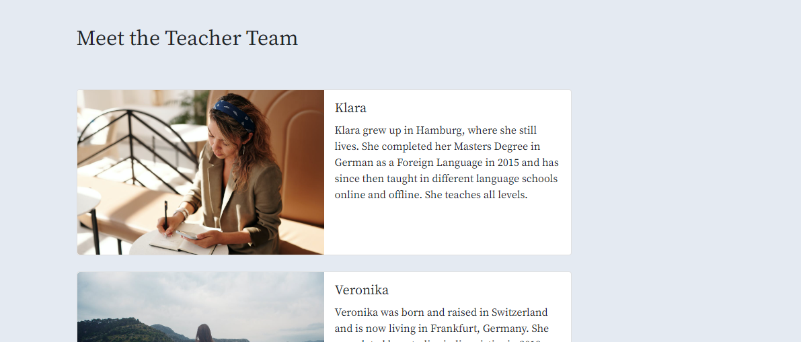
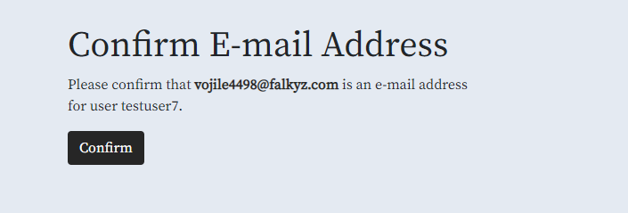

## Testing 

## Manual Testing

### Testing User Stories

The website functionality with all user stories has been tested manually while logged in as testusers or admin and while not logged in. 

#### Student
##### Viewing and Navigation
1.	As a student I can see the home page so that I get an overview of what I can learn.
    
    
2.	As a student I can see and browse all available courses so that I can make a choice on which one to book.
    
3.	As a student I can see the details of an individual course so that I can see all necessary information including a course description.
    
4.	As a student I can see general information about the offered courses and language levels so that I can decide better which course is the right one for me.
    
5.	As a student I can see information about the teachers so that I can reassure myself about the quality of the offered classes.
    
6.	As a student I can see contact details of the language school so that I can get in touch in case I have additional questions.
    
    - A contact form can be filled in. Valid information has to be provided before sending.
        
7.	As a student I can see a link to the schools Facebook page so that I can connect with them via social media.
    
8.	As a student I can sign up for the schools newsletter so that I can receive newsletters with up-to-date information.
    

##### User account
9.	As a student I can register for an account so that I am able to view my profile.
    
    - The signup was tested with testaccounts.
    - It is not possible to sign up with missing or incorrect fields.
        
    - After signing up an email is sent to verify the email address.
        
        
    - After signup it is possible to login and access the My Profile Page
        
10.	As a student I will receive a confirmation email after registering so that I know that my account registration was successful. 
    
11.	As a student I can login and logout of my account so that I can access my personal information.
    
    
    - All necessary fields have to be filled correctly to sign in.
        
12.	As a student I have a personalized user profile so that I can view the courses that I have booked.
    
13.	As a student I can recover my account password so that I can access my account in case I forgot my password.
    - A Forgot Password Link is available on the login page.
        
    - When clicked, an email can be sent with recovery information.
        

##### Sorting and Searching
14.	As a student I can sort the list of all available courses by level so that I can see courses matching my current language level.
    - A drop down menu to sort the courses is available
        
    - Courses can be sorted by level
        
15.	As a student I can sort the list of all available courses by course format so that I can quickly choose courses from my preferred course format.
    - A drop down menu to sort the courses is available
        
    - Courses can be sorted by level
        
16.	As a student I can sort the list of all available courses by the start date of the course so that I can choose a course that starts on a suitable date.
    - A drop down menu to sort the courses is available
        
    - Courses can be sorted by date
        
17.	As a student I can sort the list of all available courses by the weekday on which the course will take place so that I can find a course that fits my schedule.
    - A drop down menu to sort the courses is available
        
    - Courses can be sorted by weekday
        
18.	As a student I can search for a course by level or course format to find a specific course that I want to book.
    - A search bar to search for courses is available
        
    - Searching for level is possible
        
    - Searching for format is possible
        
19.	As a student I can easily see what I have searched for so that I can quickly decide if my desired course is available.
    - The number of search results is displayed together with the search term below the search bar
        

##### Purchase and Checkout
20.	As a student I can see the course(s) that I have in my shopping bag so that I can see which course(s) I am about to purchase.
    
21.	As a student I can remove a chosen course from my shopping bag so that I can make changes to my purchase before I checkout.
    - A Remove button is available next to the bag item and it removes the course from the bag when clicked
        
22.	As a student I can easily enter my payment information so that I can check out quickly. 
    
    - Correct information has to be entered.
        
23.	As a student I can view an order confirmation after checkout so that I can verify I have booked the correct course(s).
    
24.	As a student I will receive an email confirmation after purchase so that I can keep the confirmation of my course(s) for my records.
    

#### Admin
25.	As an admin I can add new courses to the website so that I can immediately offer new courses once they are organized with the teachers.
    
    - Valid information has to be provided
        
26.	As an admin I can edit/update a course so that I can change the status or correct any mistakes.
    - When logged in as admin, the edit button is visible on the coursedetail page
        
    - The course can then be updated
        
    - Valid information has to be provided
        
27.	As an admin I can delete a course so that I can remove a course I have accidentally created.
    - When logged in as admin, the delete button is visible on the coursedetail page
        
    - When clicking on it a confirmation page will be shown before final deletion
        

#### Student + Admin
28. As a student/admin I can see messages on the screen so that I know the result of my input.
    
    

### Javascript
- JavaScript
    - JavaScript was used for the time out function of django contrib messages.
         - This was tested manually. The messages displayed dissappear automatically.
    - JavaScript was used for the sorting dropdown on the courses page.
        - This code was taken from the Boutique Ado walkthrough project from Code Institute
        - This was tested manually as well. 
        - The sorting box works.
        
        
        
    - JavaScript was used to handle stripe payments in stripe_elements.js in the checkout app
        - This code was taken from the Boutique Ado walkthrough project from Code Institute and comes from www.stripe.com
        - This was tested manually. The checkout with stripe test credit cards works.

### Browser Compatibility

- The page has been tested and works in different browsers.
  - Google Chrome
    
    

  - Firefox
    
    
  
  - Microsoft Edge
    
    

### Responsiveness

- The project is responsive and functions on all standard screen sizes using the devtools device toolbar.

- The navigation, home page, our courses, course information, our teachers, contact, profile, shopping bag, checkout, checkout success, add/edit/delete course and the footer are readable and easy to understand.

  -  Google Chrome Desktop

    

  - Google Chrome Mobile

    

  - Firefox Desktop

    

  - Firefox Tablet

    
  
  - Microsoft Edge Desktop

    
  
  - Microsoft Edge Mobile

    

## Color Testing

- All colors have been tested with a contrast checker. 
  - Contrast test #E4EAF2 against #000. (main background color against font color)
  
  - Contrast test #B8C6D9 against #000. (navbar and footer background color against font color)
  
  - Contrast test #262626 against #FFF. (background color for the buttons against font color of the buttons)
  
  - Contrast test #8C0303 against #FFF. (background color for the hovered buttons against font color of the hovered buttons)
  
  - Contrast test #8C0303 against #B8C6D9. (font color of the disclaimer in the footer against footer background color)
  
  - Contrast test #8C0303 against #E4EAF2. (font color of the warnings/disclaimer against the light blue background color)
  
  - Contrast test #262626 against #B8C6D9. (font color of the navbar links against the navbar background color)
  
  - Contrast test #262626 against #E4EAF2. (font color of the website links against the light blue background color)
  

## Validator Testing 

- PEP8

  - No errors were returned from [PEP8online.com](http://pep8online.com/).

    

    
Click to expand to view the PEP8 testing

 
      - bag app

        urls.py
        
        

        views.py

        

      - checkout app

        admin.py

        

        forms.py

        

        models.py

        

        signals.py

        

        urls.py

        

        views.py

        

      - contact app

        admin.py

        

        forms.py

        

        models.py

        

        urls.py

        

        views.py

        

      - courseinfo app

        urls.py
        
        

        views.py

        

      - courses app

        admin.py

        

        forms.py

        

        models.py

        

        urls.py

        

        views.py

        

      - home app

        admin.py

        

        forms.py

        

        models.py

        

        urls.py

        

        views.py

        

      - main app languageschool

        urls.py

        

        views.py

        

      - profiles app

        forms.py

        

        models.py

        

        urls.py

        

        views.py

        

      - teachers app

        urls.py
        
        

        views.py

        

    

- HTML

  - No errors were returned when passing through the official [W3C validator](https://validator.w3.org/)

    

    
Click to expand to view the HTML testing

    - Bag

        Propper authentication needed to access this page

        [bag W3C validator]()

        

    - Checkout

        Propper authentication needed to access these pages

        - checkout.html
        - checkoutsuccess.html

        [checkout W3C validator]()

        

        [checkout success W3C validator]()

        

    - Contact

        [contact W3C validator](https://validator.w3.org/nu/?doc=https%3A%2F%2Flanguageschoolproject.herokuapp.com%2Fcontact%2F)

        

    - Courseinfo

        [courseinfo W3C validator](https://validator.w3.org/nu/?doc=https%3A%2F%2Flanguageschoolproject.herokuapp.com%2Fcourseinfo%2F)

        

    - Courses

        [course detail W3C validator](https://validator.w3.org/nu/?doc=https%3A%2F%2Flanguageschoolproject.herokuapp.com%2Fcourses%2F29%2F)

        

        [courses W3C validator]()

        

        

        Propper authentication needed to access these pages:

        - add_course.html
        - delete_course.html
        - edit_course.html

        [add course W3C validator]()

        

        [delete course W3C validator]()

        

        [edit course W3C validator]()

        
    
    - Home

        [home W3C validator](https://validator.w3.org/nu/?doc=https%3A%2F%2Flanguageschoolproject.herokuapp.com%2F)

        

    - Profiles

        Propper authentication needed to access this page

        - profile.html

        [profiles W3C validator]()

        

    - Teachers

        [teachers W3C validator](https://validator.w3.org/nu/?doc=https%3A%2F%2Flanguageschoolproject.herokuapp.com%2Fteachers%2F)

        

    - Account

        login.html

        [login W3C validator](https://validator.w3.org/nu/?doc=https%3A%2F%2Flanguageschoolproject.herokuapp.com%2Faccounts%2Flogin%2F)

        

        signup.html

        [signup W3C validator](https://validator.w3.org/nu/?doc=https%3A%2F%2Flanguageschoolproject.herokuapp.com%2Faccounts%2Fsignup%2F)

        

        Propper authentication needed to access this page
        - logout.html

        [logout W3C validator]()  

        

    

- CSS
  - No errors were found when passing through the official [(Jigsaw) validator](https://jigsaw.w3.org/css-validator/validator?uri=https%3A%2F%2Flanguageschoolproject.herokuapp.com%2F&profile=css3svg&usermedium=all&warning=1&vextwarning=&lang=en)

      

- Accessibility
  - The page passes the accessibility test using lighthouse in devtools

    

## Bugs
### Fixed Bugs

The following bugs were tracked and fixed using the GitHub Issues tracker with the label of "bug".

[GitHub Issues Tracker Closed Issues](https://github.com/JulianeGampe/language-school/issues?q=is%3Aissue+is%3Aclosed)

- **Calculating shopping bag total not working** - [#1](https://github.com/JulianeGampe/language-school/issues/28)
- **NoReverseMatch at /courses/edit/10** - [#2](https://github.com/JulianeGampe/language-school/issues/29)
- **Navbar Dropdown not opening** - [#3](https://github.com/JulianeGampe/language-school/issues/30)
- **Allauth templates cannot be changed** - [#4](https://github.com/JulianeGampe/language-school/issues/32)

### Remaining Bugs

- No remaining bugs that I am aware of.

---

Return to the [README](README.md) file
